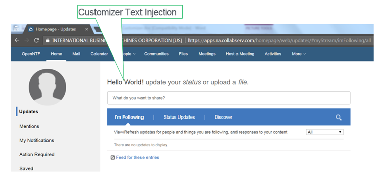
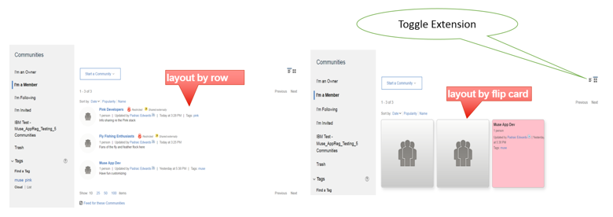
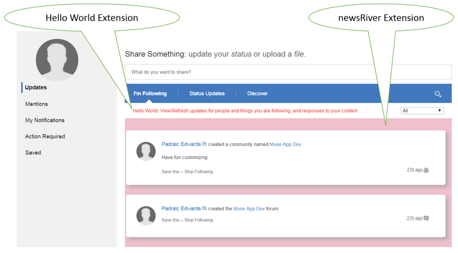
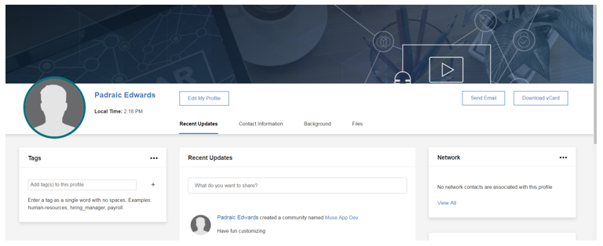

IBM Connections Customizer

Online Customizer documentation from the developer community


# Table of Contents

[IBM Connections Customizer 2](#ibm-connections-customizer)

[Listing 1 – Hello World Customizer App
2](#listing-1-hello-world-customizer-app)

[Listing 2 – Customizer Application Properties
3](#listing-2-customizer-application-properties)

[A Closer Look at Customizer Properties
5](#a-closer-look-at-customizer-properties)

[Listing 3 – Examples of IBM Connections URLs
6](#listing-3-examples-of-ibm-connections-urls)

[Customizer Payload Properties 7](#customizer-payload-properties)

[Listing 4 – Customizer App With URL Matching
7](#listing-4-customizer-app-with-url-matching)

[Listing 5 – Global Customizer App With URL Matching
8](#listing-5-global-customizer-app-with-url-matching)

[Listing 6 – Whitelist: Customizer App Targetting Specific Users By Name
9](#listing-6-whitelist-customizer-app-targetting-specific-users-by-name)

[Listing 7 – Blacklist: Customizer App Excluding Specific Users By Id
9](#listing-7-blacklist-customizer-app-excluding-specific-users-by-id)

[Customizer Cache Management 9](#customizer-cache-management)

[Listing 8 - Controlling Caching of Include-Files
10](#listing-8---controlling-caching-of-include-files)

[The Request Life Cycle for IBM Connections Customizer
12](#the-request-life-cycle-for-ibm-connections-customizer)

[Figure 1 – IBM Customizer Request Life Cycle
12](#figure-1-ibm-customizer-request-life-cycle)

[Include Files for Code Injections
14](#include-files-for-code-injections-1)

[Figure 2 – IBM Connections Developers Organization on GitHub
15](#figure-2-ibm-connections-developers-organization-on-github)

[Listing 9 – Sample acl.ids file 16](#listing-9-sample-acl.ids-file)

[A Peek Inside Some Samples 17](#a-peek-inside-some-samples)

[Listing 10 – Hello World Include File
17](#listing-10-hello-world-include-file)

[Figure 3 Hello World Extension for IBM Connections Homepage
18](#figure-3-hello-world-extension-for-ibm-connections-homepage)

[Listing 11 – Customizer Script Injection
19](#listing-11-customizer-script-injection)

[Standard Samples 19](#standard-samples)

[Figure 4 Communities Page before and after Flipcard Customization
20](#figure-4-communities-page-before-and-after-flipcard-customization)

[Figure 5 Multiple Extensions for IBM Connections Homepage
21](#figure-5-multiple-extensions-for-ibm-connections-homepage)

[Figure 6 Profile Page Extension 21](#figure-6-profile-page-extension)

[Listing 12 – Multiple Include Files
22](#listing-12-multiple-include-files)

[Getting Up and Running 23](#getting-up-and-running)

[Some Points to Note regarding Customizer Applications
24](#some-points-to-note-regarding-customizer-applications)

[Useful Online References 24](#useful-online-references)

# IBM Connections Customizer

IBM Connections Customizer is a middleware proxy service that enables
the customization of the IBM Connections user experience. In essence
Customizer acts as a proxy between IBM Connections and the end-user,
which gives it the ability to intercept and modify requests and
responses, and thus customize anything that flows through it, e.g. the
behaviour of APIs, the presentation of the user interface, etc. This
document focuses on customizations of the user interface.

The IBM Connections Customizer model is simple: the service can perform
customizations by injecting JavaScript or CSS into the HTML pages
returned by IBM Connections in response to end-user requests – where
requests are defined as the URLs generated according as the end-user
navigates within standard components like Communities, Profiles, Files,
Blogs, Homepage etc. The customization details, i.e. typically the code
that should be inserted and on particular requests, are defined by
application extensions stored inside the IBM Connections Application
Registry (or App Reg for short).

App Reg is a centralized design repository used to store and retrieve
applications that customize and extend a variety of different IBM
Connections services. There are many defined services, Customizer is
just one instance. In the cloud, App Reg is available to organization
*administrators* via the **Admin \> Manage Organization \> Organization
Extensions** menu path. From here it’s possible to create and manage
Customizer applications by clicking the **new Apps Manager** link on the
workspace. App Reg is also available for IBM Connections On-Premises as
part of the [Component Pack for
V6.0.0.4](http://www-01.ibm.com/common/ssi/ShowDoc.wss?docURL=/common/ssi/rep_ca/3/877/ENUSZP18-0053/index.html&lang=en&request_locale=en)
released in January 2018. As an administrator you can access App Reg
On-Premises using this URL: `http://*yourConnectionsUrl.com*/appreg/`

## Listing 1 – Hello World Customizer App
```json
{
   "services":[
      "Customizer"
   ],
   "name":"Simple Customizer Sample",
   "title":"My First Customizer App",
   "description":"Perform a modification to the Connections Homepage",
   "extensions":[
      {
         "name":"Hello World Extension",
         "type":"com.ibm.customizer.ui",
         "path":"homepage",
         "payload":{
            "include-files":[
               "helloWorld/helloWorld.user.js"
            ],
            "include-repo":{
               "name":"global-samples"
            }
         }
      }
   ]
}
```
Whether On-Cloud or On-Premises, the **Apps Manager** workspace provides
a single consistent user interface for [managing Customizer
apps](https://rtpdoc01.rtp.raleigh.ibm.com:9443/kc/SSYGQH_test/admin/customize/customize_manage_customizer_apps.html).
A Customizer app is nothing more than a JSON file containing design
metadata that identifies the components that need to be targeted and the
actions that need to be performed. Listing 1 is an illustration of a
rudimentary Customizer application.

The application JSON in Listing 1 requires little explanation. The
following points can be inferred by a quick inspection of the code:

  - The app is named “Simple Customizer Sample” and it extends the `Customizer` service

  - It contains **one** extension named “Hello World Extension” (apps can have many)

  - The extension is a customization of the UI (line \#11 - `"type": "com.ibm.customizer.ui"`)

  - The customization applies to the Connections homepage (line \#12 - `"path": "homepage"`)

  - A file named `helloWorld.user.js` is to be injected into the homepage (line \#15)

  - `helloWorld.user.js` is retrieved from a global repository of Customizer samples

A more complete summary of the properties used in Listing 1 is shown below:

## Listing 2 – Customizer Application Properties
| Property         | Description                                                                                  |
| -------------    | -------------                                                                                |
| `name`           | String used to identify the extension                                                        |
| `title`          | Short string description - translatable for international audiences                          |
| `description`    | Long string description - translatable for international audiences                           |
| `services`       | The service(s) with which the application is associated                                      |
| `type`           | Mandatory string used to identify the extension point being implemented                      |
|                  | Valid values are as follows:                                                                 |
|                  | *com.ibm.customizer.ui*                                                                      |
|                  | *com.ibm.customizer.api*                                                                     |
|                  | *com.ibm.customizer.proxy*                                                                   |
| `path`           | String value used to identify the component to be customized:                                |
|                  | *activities*                                                                                 |
|                  | *blogs*                                                                                      |
|                  | *downloads*                                                                                  |
|                  | *files*                                                                                      |
|                  | *forums*                                                                                     |
|                  | *global* \*                                                                                  |
|                  | *homepage*                                                                                   |
|                  | *manage*  \*\*                                                                               |
|                  | *meetings*                                                                                   |
|                  | *metrics*                                                                                    |
|                  | *mycontacts*                                                                                 |
|                  | *news*                                                                                       |
|                  | *profiles*                                                                                   |
|                  | *search*                                                                                     |
|                  | *social*                                                                                     |
|                  | *viewer*                                                                                     |
|                  | *wikis*                                                                                      |
|                  | \* Unlike the other path values, global does not represent a real URL path element           | 
|                  |  but is a keyword meaning match all URLs.                                                    |
|                  | \*\* The manage path does not cover all possible IBM Connections `manage` URL paths.         | 
|                  | */manage/subscribers/showInviteGuestDialog/input*                                            |
|                  | */manage/account/user/input*                                                                 |
|**`payload`**     | **The properties described below can be applied in the `payload` object definition when the extension point is `com.ibm.customizer.ui`** |  
|`match/exclude`   | A test criterion that determines whether or not the nominated `include-files` are inserted into the response. Either a `match` **OR** an `exclude` test condition can be applied to an extension - not both, i.e. they are mutually exclusive!  Tests are evaluated against a `url` sub-property or one of the three `user-xxxx` sub-properties (see next four rows). If the test result is positive then the `include-files` are inserted on a `match` or omitted on an `exclude`.|
| > `url`          | A [regular expression](https://www.regular-expressions.info/) applied to the active Connections URL.                                 |
| > `user-name`    | String used to identify one or more users as the target for the customization. This  property is **not unique** within a given organization |
| > `user-email`   | String used to identify one or more users as the target for the customization. This property **is unique** within a given organization | 
| > `user-id`      | IBM Connections user-id used to identify one or more users as the target for the customization. This property **is unique** within a given organization |
|`include-files`   | List of files to be inserted into the response for a selected page request                    |
|`cache-headers`   | One or more string values corresponding to standard HTTP cache header name/value pairs. Value(s) must be from the following list: `cache-control, expires, last-modified, pragma` e.g. `"expires": "Tue, 25 Dec 2018 00:00:00 GMT"`. All `cache-headers` values are treated as pass-through data that will be set **as-is** in the Customizer HTTP response and not validated.                                                                                  |
|**`payload`**     | **The properties described below can be applied in the `payload` object definition when the extension point is `com.ibm.customizer.proxy`** |  
|**TBC...**     | ... | 

### A Closer Look at Customizer Properties

The properties outlined in Listing 2 can be broken down into two
categories:

1.  Generic App Reg Properties

Properties defined for *all* App Reg applications across all services

2.  Customizer Service Properties

Properties specific to the Customizer service, i.e. *everything in the **Payload** section*. 
**Note:** `Payload` properties will vary according to the extension point being used. In other words,
the `payload` properties are contextual so the `com.ibm.customizer.ui` extension point properties will 
differ to those defined for `com.ibm.customizer.proxy`.

In terms of the generic properties, App Reg requires that any
application specify `name`, `title`, `description`, `service` and
`type` property values. The Application Registry specification does
not require the `path` property to be specified when an application is
created, but the Customizer service puts it to good use for every
request it processes, as will be seen shortly. Ergo, in reality for
Customizer applications, a `path` value is *required* in order for
them to work properly.

Of the generic properties outlined in Listing 2, only `type` and
`path` merit any further discussion. A `type` value always equates
to an extension point defined by a service. At present Customizer only
defines two extension points, com.ibm.customizer.ui and
com.ibm.customizer.api. The former is a declaration that a given
Customizer extension performs a modification to the IBM Connections UI,
and thus will be handled in accordance with a prescribed UI extension
pattern – for example any `include-files` specified in the `payload`
are always injected into the response document. The latter is reserved
for future use – suffice to say that as a middleware proxy Customizer is
capable of modifying API behaviours, but that use case is not catered
for in the current Customizer release.

For Customizer applications, the `path` property value is used to
identify a path element in the IBM Connections request URL, which in
most use cases corresponds to a standard IBM Connections component.

Consider the URLs displayed in Listing 3 - these sample URLs follow a
clear pattern where the next element after the IBM Connections cloud
domain name identifies the Connections component or application handling
the request. The possible values of this element map to the `path`
values enumerated in Listing 2, i.e. homepage, communities, files, etc.

## Listing 3 – Examples of IBM Connections URLs
```javascript
/* homepage */
//w3-connections.ibm.com/homepage/web/updates/#myStream/imFollowing/all
//w3-connections.ibm.com/homepage/web/updates/#myStream/statusUpdates/all
//w3-connections.ibm.com/homepage/web/updates/#myStream/discover/all
//w3-connections.ibm.com/homepage/web/updates/#atMentions/atMentions

/* communities */
//w3-connections.ibm.com/communities/service/html/ownedcommunities
//w3-connections.ibm.com/communities/service/html/followedcommunities
//w3-connections.ibm.com/communities/service/html/communityinvites

/* files */
//w3-connections.ibm.com/files/app#/pinnedfiles
//w3-connections.ibm.com/files/app#/person/7f37da40-8f0a-1028-938d-db07163b51b2

/* blogs */
//w3-connections.ibm.com/blogs/roller-ui/allblogs?email=joe_schmoe
//w3-connections.ibm.com/blogs/roller-ui/homepage?lang=en_us

/* wikis */
//w3-connections.ibm.com/wikis/home?lang=en-us#!/mywikis?role=editor
```
It follows that according as http requests flow through Customizer it
can query the Application Registry for any extensions relating to a
given request URL and reduce the scope of the result set by specifying
the particular in-context `path` value. Thus a typical REST request
from Customizer to App Reg for Files customizations might look like
this:
```
appregistry/api/v3/services/Customizer/extensions?type=com.ibm.customizer.ui&path=files
```

This API request translates as “get all UI extensions registered for the
Customizer service that apply to Files”. This should clarify why
Customizer extensions must contain both a `type` and `path` value.
One caveat to note with regard to the `path` value is the existence of
the special `global` key word. This is designed to address the use case
where an extension needs to apply to *all* requests and it would be
clearly inefficient to have to create an extension for every possible
`path` value. For example, should a customer need to display some
corporate footer text at the bottom of every page in IBM Connections
then a global extension would facilitate that.

In response to the request shown above, App Reg returns whatever number
of extensions match these criteria, i.e. a single collection of one or
more JSON files just like the one shown previously in Listing 1. It is
then up to the Customizer service implementation to parse and apply the
design metadata contained in the returned extensions – and that is where
the `payload` data comes into play.

### Customizer Payload Properties

As should now be evident, the generic `path` property provides a
coarse means of querying the Application Registry for extensions
pertaining to a given IBM Connections component. The optional `match`
properties inside the Customizer `payload` provide a further means of
fine-tuning the filtering of extensions and essentially deciding whether
an extension should be applied to a given URL request or not. All
`payload` properties are meaningless to the App Registry – they are
always just passed back to the nominated service container (Customizer
in this instance) for processing.

#### Fine Grained URL Matching

The `match url` property takes a regular expression and evaluates it
against the current URL. If the expression matches then the extension is applied. 
If no match occurs, the extension is not applied. Conversely the `exclude url` property
will **not** insert the nominated `include-files` if the regular expression produces a match. This is a powerful feature as the following code snippets will demonstrate.

Listing 4 shows a Communities extension that has a fine-grained URL
match applied on lines 14 – 16. This extension is only applied if the
Communities followedcommunities URL is being processed, and so this
extension is ignored for other Communities URLs like those shown in
Listing 3, i.e. ownedcommunities, communityinvites, etc.

## Listing 4 – Customizer App With URL Matching
```json
{
   "services":[
      "Customizer"
   ],
   "name":"Communities Customization",
   "title":"UI Customization for Communities I Follow",
   "description":"Sample to modify Connections Communities",
   "extensions":[
      {
         "name":"Followed Communities Customizer",
         "type":"com.ibm.customizer.ui",
         "path":"communities",
         "payload":{
            "match":{
               "url":"followedcommunities"
            },
            "include-files":[
               " flipCard/commListCardsFlipStyle.user.js "
            ],
            "include-repo":{
               "name":"global-samples"
            }
         }
      }
   ]
}
```

Similarly, the following fragment shows how a single global extension
can be applied to Homepage and Communities but nothing else:

##  Listing 5 – Global Customizer App With URL Matching
```json
"path":"global",
"payload":{
   "match":{
      "url":"homepage|communities"
   }
}
```
**Note:** The design of some IBM Connections components like Homepage
are based on the Single Page App paradigm. For example, look at the
homepage URLs at the top of Listing 3 – all contain hashtags which means
that new http requests are not fired as the user navigates around the
page. Thus Customizer is not notified for example when a user moves from
imfollowing to atmentions. By contrast this is not the case in
Communities when a user moves from ownedcommunities to
followedcommunities. Thus a developer can target individual Communities
URLs using the `match url` property but cannot use the same technique
to match the Homepage hashtag URLs. Instead a homepage extension would
need to inject a script that would listen for hash change events and
respond accordingly. An example is included in the homepage samples:
[newsRiverSectioned.user.js](https://github.com/ibmcnxdev/customizer/blob/master/samples/newsRiver/newsRiverSectioned.user.js). 
In particular take a look at the `handleHashChangeEvent()` function contained within.

It’s easy to envisage many other use cases that would require
fine-grained match criteria. For instance, if a customer wants to apply
a customization to any Files URL that contains a GUID then this can be
achieved by setting the path value to “files” and the match `url`
value to “id=\[a-z0-9\]{8}-(\[a-z0-9\]{4}-){3}\[a-z0-9\]{12}” – refer
back to Listing 3 for an example of such a Files URL. Be aware that the
various braces contained in the regular expression would need to be
escaped (i.e. preceded by a backslash character: \\) when entered into
JSON content stored in App Reg.

#### Fine Grained Matching based on the Active End-User

The `match` and `èxclude` properties also accept various user related conditions
based on the current user’s name, email or id. In all cases single or
multi-value parameters may be provided, or in JSON parlance a single
string value or an array of strings can be specified. The fragment
illustrated in Listing 6 shows how a Communities extension can be
specifically targeted at specific users based on their user names: Jane
Doe and Joe Schmoe in this example.

It is important to realise that user names are not unique within an
organization so it’s possible to inadvertently target unintended users
by employing this technique, i.e. any users of the same name will see
the extension. 

## Listing 6 – Whitelist: Customizer App Targetting Specific Users By Name
```json
"path":"communities",
"payload":{
   "match":{
      "user-name":[
         "Jane Doe",
         "Joe Schmoe"
      ]
   }
}
```

Listing 6 is an example of what's known as a whitelist, i.e. the application is applied 
only for those users explicitly called out in the `user-name` array. To do the opposite,
i.e. apply the customizations for everyone _except_ a list of specific users (a blacklist)
you can use the `exclude` property instead as shown in Listing 7.

## Listing 7 – Blacklist: Customizer App Excluding Specific Users By Id
```json
"path":"communities",
"payload":{
   "exclude":{
      "user-id":[
         "20071635",
         "20071656"
      ]
   }
}
```
To avoid possible ambiguity you can apply a precise filter by using the
`user-id` sub-property instead of the `user-name`. Note that the term “user id” is
sometimes referred to as “subscriber id” in the IBM Connection UI and documentation.

******
### Customizer Cache Management

Listing 2 provided a summary description of a cache-headers payload
property that enables particular HTTP cache settings to be applied for
resources served up by the Customizer service. If you set one or more
literal HTTP cache headers as the value for this property then these
specified values are passed through by Customizer as headers in the HTTP
response when the referenced include-file is requested from a browser
client.

On IBM Connections Cloud however, there is a built-in caching feature
which applies automatically to Customizer resources based on the entity
tag (ETag) HTTP header feature. This feature is also planned for IBM
Connections On-Premises. Thus in the cloud environment today, the
explicit *cache-headers* payload property need only be applied *if you
wish to override the default ETag behaviour* provided out of the box by
Customizer.

#### Customizer Automatic ETag Support on IBM Connection Cloud

When a JavaScript or CSS resource is first served up by Customizer it
generates a unique ETag for the resource. The ETag value is in the form
of a GUID (or UUID) and this 128-bit unique number is set as the ETag
header in the response for the JS/CSS request. The next time the same
resource is requested by an end-user, the client browser will send back
an If-None-Match HTTP header as part of the request with the same ETag
GUID value. The Customizer service will then validate the ETag value
against its internal cache for the requested resource and, if found,
will send a 304 Not Modified response back to the browser. Effectively
this tells the browser that the JS/CSS content has not changed and the
browser can use the version of the resource that it holds in its own
local cache.

The net of all that is that the client/server interaction is much more
light weight than would otherwise be the case. For example if the
browser already has a cached copy of a Customizer JS include-file, then
that resource is loaded from the local client data store and not sent
back down by the Customizer service for every request. Thus the
roundtrip is much more like a conditional ping to check if a local
cached resource is still valid and all responses, apart from the first
one, will not include the JS/CSS payload. The payload of course is of
arbitrary size – and the larger the resource, the longer the response
time.

When an update occurs in the include-repo containing the injectable
resources for a Customizer app, then the ETag associated with that
repository is invalidated and evicted from the Customizer internal
cache. Thus once the next request is received for resources associated
with the updated repository, a new ETag is generated and the latest
resources are served up and cached once again in the browser from that
point forward.

#### **The Cache-Headers Property**

The cache-headers property enables you to enforce your own (non-ETag
based) caching policy. If you specify cache-headers values you
effectively turn off the ETag mechanism and replace it with whatever
HTTP cache headers are declared in the JSON payload. Listing 8 is a JSON
fragment showing how a HTTP cache header can be applied.

## Listing 8 - Controlling Caching of Include-Files
```json
"path":"communities",
"payload":{
   "include-files":[
      " flipCard/commListCardsFlipStyle.user.js "
   ],
   "include-repo":{
      "name":"global-samples"
   },
   "cache-headers":{
      "expires":"Tue, 25 Dec 2018 00:00:00 GMT"
   }
}
```
Other HTTP cache headers can be set in the same way, namely:
cache-control, last-modified and pragma. These headers can be mixed and
matched to form a caching policy to suit your needs. The values
specified in JSON payload are not validated by Customizer – they are
assumed to be valid and passed through as-is. There are many public
sources of information on the [syntax of the HTTP cache
headers](https://developer.mozilla.org/en-US/docs/Web/HTTP/Headers/Cache-Control)
and how [they can be best applied to satisfy different use
cases](https://developers.google.com/web/fundamentals/performance/optimizing-content-efficiency/http-caching).

******

### The Request Life Cycle for IBM Connections Customizer

To summarize what’s been discussed thus far, Customizer is a proxy and
all Connections requests and responses flow through it. Customizer
queries the App Registry to ascertain if customizations have been
registered for components of Connections based on the paths of the URL
requests it processes. Whenever App Registry does return application
definitions to Customizer, the metadata contained in the JSON payload is
used to finally decide whether or not a customization should be applied.
This request processing mechanism can be succinctly summarized in Figure
1 as follows:

## Figure 1 – IBM Customizer Request Life Cycle
  
  


You have already read about how Customizer generates App Registry
queries and how request matching is performed based on the application
payload data. The next thing to figure out is how the file resources
listed in the include-files property are managed.
******
### Include Files for Code Injections

The include-files payload property lists one or more files to be
inserted into the Connections http response thus becoming part of the
DOM structure loaded in the end-user’s browser. Listing 1 shows a simple
single-item value for this parameter: "helloWorld/helloWorld.user.js",
where helloWorld is a folder and helloWorld.user.js is a JavaScript file
contained within. This raises a number of interesting questions:

1.  **Where do these files reside?**

For IBM Connections Cloud, any files declared in the `include-files`
property list are stored in one of two locations:

1)  a private IBM [GitHub](https://github.com/) organization (i.e.
    github.ibm.com - accessible only to IBM)

2)  a public IBM Connections GitHub organization -
    <https://github.com/ibmcnxdev>

The include-repo payload property value identifies the name of the
actual repository. For example, in Listing 1 and Listing 4 you see an
include-repo object with a name value of "global-samples" being used.
This is a reference to a repository on github.ibm.com that contains
ready-made samples that any IBM Cloud tenant can use in a Customizer
app. "Hello World", "FlipCard" and the other samples featured later in
the [Standard Samples](#standard-samples) section are all located in
this repository. IBM Customizer resolves the GitHub organization
referred to in the JSON markup –i.e. whether it is in the private or
public location. IBM has control over the repositories that are
created in both locations so no duplicate names are allowed.

2.  **How do they get there?**

Customizer assets like the aforementioned global-samples are directly
provisioned to github.ibm.com by the IBM Customizer team. Since this
is a private GitHub organization you cannot explore it to discover
what repositories are available, but you become aware of them through
public samples, documentation and other enablement materials (such as
this). It is envisaged that an enhanced App Reg IDE may expose these
repositories through the UI in a future release.
 
On the other hand you can freely explore the assets available on the
public IBM Connections Developers GitHub organization (see Figure 2).
By default you are free to leverage any Customizer repository within
this organization or to collaborate with the IBM Customizer team to
create your own repo in this location. This could be a fork of an
existing repository or a brand new repo created for you from scratch,
depending on your needs.
 
If you are familiar with GitHub and have a GitHub account then you are
already well on your way. If not, then you can start learning about
GitHub here using this [quick 10 minute
guide](https://guides.github.com/activities/hello-world/). Once you
know the rudiments, then [creating a GitHub
account](https://help.github.com/articles/signing-up-for-a-new-github-account/)
is straight-forward and free for public and open-source projects.
 
In order to inject *your own include-files* into a Customizer app you
need a GitHub repository on the public
[github.com/ibmcnxdev](https://github.com/ibmcnxdev) organization.
Typically developers have their own repo that they share with IBM –
the step by step procedure is as follows:

1.  Share your repo with IBM – [add "ibmcndev" as a
    collaborator](https://help.github.com/articles/inviting-collaborators-to-a-personal-repository/)

2.  IBM (ibmcnxdev) then creates a fork of your repository under
    github.com/ibmcnxdev and grants you read access by default.

3.  You can continue to work on your extension using your original repo
    for your source code activity, but once you are ready to deliver to
    IBM Cloud you must issue a [pull
    request](https://help.github.com/articles/creating-a-pull-request/#changing-the-branch-range-and-destination-repository)
    to IBM.

4.  IBM merges your pull request once acceptance criteria are met.

5.  Upon merge, the repo files are automatically pushed to IBM
    Customizer via a webhook.

6.  Rinse & repeat starting at Step (c) for extension updates.

Step (c) requires you to issue a Pull Request *across forks* (in
GitHub parlance). The key thing to remember is that your original repo
which contains the latest changes is always the “head fork”, while the
“base fork” must refer to the repo on
[github.com/ibmcnxdev](https://github.com/ibmcnxdev).

Step (d) involves an initial lightweight summary review by IBM which
looks at various aspects of the proposed customization, primarily from
a performance, security and documentation standpoint. However ultimate
responsibility for the quality and behaviour of the app remains that
of the customer who creates or adopts the customization. The review
process by IBM provides no guarantee whatsoever of protection against
adverse security or performance impacts.

## Figure 2 – IBM Connections Developers Organization on GitHub


>> **<span class="underline">TIP:</span>** More information on how to
integrate your Customizer include files with IBM Connections Cloud is
available in video for on opencode4connections.org:

<https://opencode4connections.org/oc4c/customizer.xsp?key=ccc-episode2>

***Restricting Access to Include-Files***

By default the contents of any repository in either GitHub organization
are available for use by Customizer apps by any IBM Cloud tenant. This
is a very flexible and convenient model but may not always be the
desired solution for every situation. Some tenants may prefer to keep
the include-files for Customizer apps private to themselves, or restrict
usage to a subset of tenants. Different solutions exist to address these
needs:

1.  **Access Control Lists for Tenant Organizations**

Access Control Lists (ACLs) are used to manage access to a particular
object. IBM Connections Customizer provides a very simple
implementation of an ACL which can control which tenant organizations
are allowed to load include files from your repos. All you need to do
is to provide an acl.ids file at the root of your project and populate
it with the IBM Connections Cloud ids of the tenant organizations to
whom you wish to grant access.

## Listing 9 – Sample acl.ids file 
```
60050207
22716730
10034583
``` 
This is basically a whitelist for tenant access. Once you create an
acl.ids file in your repository then only those tenant organizations
listed in the file are allowed to use it - all others are denied
access. If no acl.ids file exists then all tenants can potentially
leverage the repo in their Customizer apps.

2.  **Private GitHub Repositories on github.com/ibmcnxdev**

GitHub users on a paid GitHub plan have the option of creating private
repositories. Private repositories can still be shared with the IBM
Connections Developers organization. The private repository will
appear in the list of projects under
[github.com/ibmcnxdev](https://github.com/ibmcnxdev) but only
administrators of ibmcnxdev will be able to see the contents – i.e.
the repo files have no visibility to regular users or to the general
public. Even though read access of the source files is restricted via
the repository, you will also need to add an acl.ids file should you
also wish to prevent runtime access from other tenant organizations.

3.  **Private Repositories on github.ibm.com**

If you have privacy needs that are not satisfied by the previous two
options you can request a private repository for your organization’s
include-files on github.ibm.com. In this situation the JSON definition
would typically not contain any include-repo reference as Customizer
will resolve the include-files location based on the tenant’s
organization id.

******
### A Peek Inside Some Samples

This journey started as most app dev stories do with a reference to a
“Hello World” application, the point of which is to jump start the
enablement process which the simplest of extensions. So what exactly
does the helloWorld.user.js include file do? Listing 10 shows the code –
certain variable names and comments have been trimmed for readability in
this document but nothing that affects the execution of the script.

## Listing 10 – Hello World Include File
```javascript
if (typeof(dojo)\ != "undefined") {
  require(\["dojo/domReady\!"\], function() {
    try {
          // utility function to wait for a specific element to load...
          var waitFor = function(callback, eXpath, eXpathRt, maxIV, waitTime) {
            if (\!eXpathRt) var eXpathRt = dojo.body();
            if (\!maxIV) var maxIV = 10000; // intervals before expiring
            if (\!waitTime) var waitTime = 1; // 1000=1 second

            if (\!eXpath) return;
            var waitInter = 0; // current interval
            var intId = setInterval(function() {
                if (++waitInter\ < maxIV && \!dojo.query(eXpath, eXpathRt).length)
                  return;

                clearInterval(intId);

                if (waitInter\ >= maxIV) {
                  console.log("**** WAITFOR [" + eXpath + "] WATCH EXPIRED!!!
                    interval "+waitInter+" (max: "+ maxIV +")");
                  }
                  else {
                    console.log("\*\*\*\* WAITFOR \[" + eXpath + "\] WATCH TRIPPED AT
                      interval "+waitInter+" (max: "+maxInter+")");
                      callback();
                    }
                  }, waitTime); // end setInterval()
              }; // end waitFor()
              // here we use waitFor to wait for the
              // .lotusStreamTopLoading div.loaderMain.lotusHidden element
              // before we proceed to customize the page...
              waitFor(function() {
                // wait until the "loading..." node has been hidden
                // indicating that we have loaded content.

                dojo.query("span.shareSome-title")\[0\].textContent = "Hello World\!";
              }, ".lotusStreamTopLoading div.loaderMain.lotusHidden");
            }
            catch (e) {
              alert("Exception occurred in helloWorld: " + e);
            }
          });
      }
```
For a simple Hello World example, this may appear to be more complicated
than expected, but a closer inspection will simplify matters. Before
perusing the code be aware of the following points:

  - Most of the code in Listing 10 is a re-usable template that any
    injection code can sit inside

  - Just 1 line of code are needed for the actual Hello World UI update:
    See the `dojo.query` statment on line 30

  - IBM Connections classic UI uses Dojo so code is injected into a Dojo
    structured page

The JavaScript code initially validates that Dojo itself is loaded and
then uses a standard Dojo utility
([domReady](https://dojotoolkit.org/reference-guide/1.10/dojo/domReady.html))
to wait for the DOM to fully load before calling a bound function to
perform the customization. Lines 2 – 23 define a function which will
wait up to a maximum of 10 seconds for the page to fully load and if
successfully loaded within that time period will execute a callback
function. If the page does not load within 10 seconds then an error is
logged to the JS console.

## Figure 3 Hello World Extension for IBM Connections Homepage



This `waitFor()` function is thus called passing in the callback function
to manipulate the DOM and modify the UI. The interesting part of the
callback function (Line 31 as already highlighted) locates a DOM element
and assigns “Hello World” as the text content. When this extension is
loaded and run by Customizer then the IBM Connections Homepage is
modified in the manner shown in Figure 3.

The code injection can be seen by viewing the source of the IBM
Connections Homepage in the browser and scrolling to the bottom of the
file. The following tag fragment should be evident:

## Listing 11 – Customizer Script Injection
```html
<script type='text/javascript'
src='/files/customizer/helloWorld/helloWorld.user.js?repoName=global-samples'\>
```

URLs leading with the '/files/customizer'path are processed by the
Customizer service. In this example it fetches the
'/helloWorld/helloWorld.user.js' script from the 'global-samples'
repository. You can use the same technique in your own JS code to
directly load resources from any repository you have access to in IBM
Connections Cloud. For instance, since the 'global-samples' is a public
repository is available to all organizations then any Customizer
application can reference resources contained inside it, using links of
this format:
```html
'/files/customizer/folder-name/resource-name.xxx?repoName=global-samples'
```
The [profiles](#profiles) sample that you will see shortly uses a
JavaScript code injection to load a CSS file from the profiles folder
under the global-samples repository. Be aware that this type of broad
access to repositories can also be prevented using the acl.ids mechanism
described earlier.

>> **<span class="underline">TIP:</span>** IBM Connections web pages
contain a lot of predefined JS variables which can be leveraged by
Customizer extensions. For instance, there is an lconn (**L**otus
**Conn**ections) object with many properties defined that any extension
script can exploit. Thus on Line \#31, replacing **"Hello World: "**
with **"Hello " + *lconn.homepage.userName* + " "** would dynamically
include the current user in the Homepage customization. The lconn object
and others like it should be explored and leveraged by your extensions.

### Standard Samples

Besides Hello World, there are a number of other ready-made Customizer
examples to be available for experimentation. The latest samples can
always be found in the samples folder of the Customizer GitHub
repository: <https://github.com/ibmcnxdev/customizer>

Each sample has its own subfolder which contains the App Reg design
definition (JSON file) and the resources to be injected to perform the
customization (JavaScript, CSS). Take a look at the following examples:

#### flipcards

This extension provides an alternative rendering for the Communities
pages so that a user’s communities can be displayed as flip cards rather
than a table of rows. Figure 4 shows a list of three communities with
the traditional row based rendering on the left hand side juxtaposed
with the flip card layout on the right. Each flip card displays the
Communities logo until the user hovers over it whereupon the card is
flipped to display the details of the community in question.

## Figure 4 Communities Page before and after Flipcard Customization



The flipCard.json file follows the standard App Reg pattern explained
already with the Hello World example. The JavaScript file
commListCardsFlipStyle.user.js uses the sample Dojo wrapper to envelope
the customization but the code itself is significantly more advanced and
serves to give a more real-world indication of the art-of-the-possible
with Customizer extensions.

Look for the Toggle Extension control on the Communities page when this
customization is applied. Clicking the button allows the user to switch
back and forth between the standard row layout and the flip card format.

#### newsRiver

This extension targets the IBM Connections Homepage and reformats the
layout of the activity stream updates by accentuating the space
surrounding each entry. Figure 5 shows the Homepage when the newsRiver
customization is run – note how the entries display as sections against
a pink backdrop. Notice that the Hello World extension is also applied
to the Homepage? This shows how multiple App Reg extensions can target
the same IBM Connections path - viewing the source of the page will show
two JavaScript file injections in this case.

## Figure 5 Multiple Extensions for IBM Connections Homepage



#### profiles

The Profiles extension delivers a more sophisticated rendering to the
page that is displayed when the user selects the “**My Profile**”
dropdown menu option in IBM Connections. The new UI look and feel is
achieved via stylesheet updates. There are two files in the profiles
subfolder - the JS file profilesCustomization.js simply inserts a link
to the profilesCustomization.css file which does all the work. The new
look Profiles page is shown in Figure 6.

Note the inclusion of a new page header graphic, the relocation of
action buttons, and so forth.

## Figure 6 Profile Page Extension



**Bringing Some Order To Proceedings**

All of the samples viewed so far are simple standalone projects.
Typically with Customizer applications there is one main entry point,
e.g. main.js, and this resource is referenced in the include-files
payload property and rendered in the modified HTML output. However the
include-files payload property is an array and can contain more than one
file reference. The snippet shown in Listing 12 is an example from the
enhanced-activity-stream project available on the [OpenCode4Connections
GitHub repository](https://github.com/OpenCode4Connections/):

## Listing 12 – Multiple Include Files
```json
"payload":{
   "include-files":[
      "enhanced-activity-stream/core.js",
      "enhanced-activity-stream/scroller.js",
      "enhanced-activity-stream/notifier.js"
   ]
}
```

The three JavaScript files referenced in Listing 12 will be injected in
the order they are listed.

Another factor to bear in mind is that Customizer applications can
contain many extensions, even though the samples described here all have
just one single extension each. An extension should ideally represent a
project which carries out a specific task or a tightly related set of
tasks. The include-files referenced in the extension must be contained
in a single include-repo, i.e. it is a strict one-to-one mapping. This
makes sense from an organizational standpoint. Extensions do specific
jobs and the tools for these jobs are typically found in a single
dedicated repository. If your application consists of many related tasks
and the tools to carry out the work are many and varied then it would
make sense for your application to have multiple extensions, where each
extension manages a discrete function and maps to a repo designed for
that purpose. Be aware though that the extensions are loaded by
Customizer in the alphabetical order of the extension names, and not the
order in which they are entered into the JSON definition of the
application. If your application has multiple extensions and is
sensitive to the load order of the include files then you can control
this by applying an ordered naming convention to your extensions.

**Note:** The alphabetical order of extensions applies *across all
applications*. For example, you may have two separate apps that target
the IBM Connections homepage. The extensions defined within both
applications will be sorted as a single alphabetical list by the App
Registry and returned to Customizer and then injected in that order into
the IBM Connections homepage.

In most cases the ordering of injections does not present a problem. You
can view the order at any time by viewing the Connections page source
and searching for the "/file/customizer" path. This section simply
describes how the injection mechanism works so that you can plan and
organize Customizer projects with that information in mind.

******
### Getting Up and Running

The sample customizations discussed in this document are available to
any IBM Connections Cloud tenant organization. Applying a sample
customization is an easy way to get started with IBM Connections
Customizer and help you get familiar with the process. Any sample can be
used put through its paces by importing the relevant JSON file into an
organization’s Application Registry. So for example, you could take a
copy of the helloWorld.json file from the helloWorld samples project
published on the [Customizer GitHub
repo](https://github.com/ibmcnxdev/customizer/tree/master/samples/helloWorld)
and import it into App Reg as follows:

1.  Go to <https://github.com/ibmcnxdev/customizer>

2.  Navigate to the helloWorld.json file and copy/paste the contents to
    a local file

3.  As Admin user in your IBM Connections Cloud organization go to:

  **Admin \> Manage Organization \> Organization Extensions**

4.  Click the **new Apps Manager** link to take you to the Pink
    Application Registry

5.  Click **New App** and then click the **Import** button once the App
    Editor appears

6.  Select your local copy of the `helloWorld.json`

7.  Insert a match criterion like the one in Listing 6 so that the
    extension is only applied to you:

  i.e. match to **your** user-name, e-mail address or user id

8.  Click **Save** to save the application into the Application Registry

9.  Refresh the IBM Connections Homepage and verify that the Hello World
    extension appears

>> **<span class="underline">TIP:</span>** The steps outlined above are
covered in an enablement video available online here:

https://opencode4connections.org/oc4c/customizer.xsp?key=ccc-episode1

You can experiment with the other samples in a similar way.

In reviewing the include files you may have noticed that some samples
use a JavaScript filename notation that follows the
[GreaseMonkey](https://en.wikipedia.org/wiki/Greasemonkey) naming
convention: somename.user.js. This is because these customizations were
originally developed as GreaseMonkey scripts using browser-based
extensions. They were then deployed on the server-side in IBM
Connections as Customizer extensions. This option is not only still
valid, it is considered a standard practice for developing Customizer
apps – i.e. create some new browser extensions using a user script
technology like GreaseMonkey for Firefox or TamperMonkey for Chrome.
Once you are happy with the local customization then you can submit the
resources to IBM for review – i.e. the JavaScript and CSS files you
create using GreaseMonkey or TamperMonkey become your Customizer
include-files. You can then invoke the customization by creating a
Customizer extension (just like the JSON files contained in the standard
samples) in the Application Registry.

******
### Some Points to Note regarding Customizer Applications

  - Support for Customizer applications follows the same
    [policy](https://www.ibm.com/support/knowledgecenter/en/SSYGQH_5.5.0/admin/customize/c_customize_overview.html)
    as any other customization to the IBM Connections UI – i.e. **IBM
    Support can address questions about the customization process, but
    cannot address questions about the particulars of your
    customization**.

  - Listing 2 provides the list of supported paths for Customizer at
    this point in time. This list currently encompasses all core IBM
    Connections apps but does not include the Administration URLs (aka
    BSS), or related IBM ICS components like IBM Docs, Chat or Verse.
	The list may be expanded to include these and possibly other
    components in the future.

  - Customizer extensions are currently restricted to the organization
    in which they have been added. For example, users from one
    organization may have access to communities in other organizations
    if they have been so invited, but they would not see any
    customizations added to such “external” communities.

### Useful Online References

**User Script Technologies:**

<https://greasyfork.org/en>

<https://tampermonkey.net/>

<http://www.greasespot.net/>

<https://zach-adams.com/2014/05/best-userscripts-tampermonkey-greasemonkey/>

<https://www.lifewire.com/top-greasemonkey-tampermonkey-user-scripts-4134335>

**IBM Connections Customizer:**

<https://opencode4connections.org/>
 
<https://github.com/ibmcnxdev/customizer>
