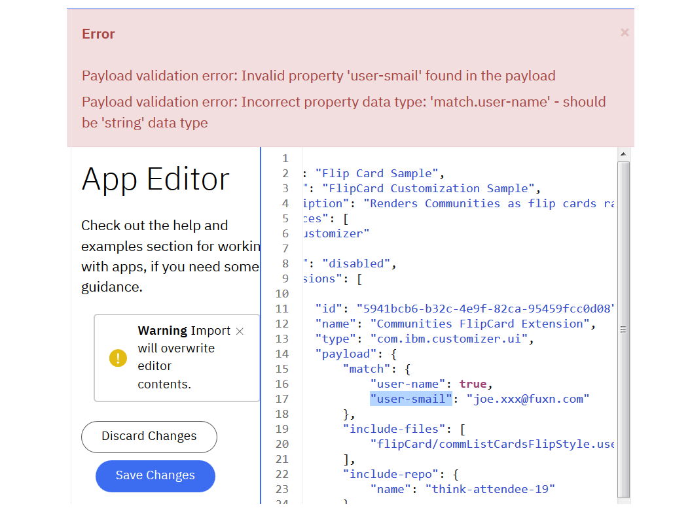

# IBM Connections Customizer

## Online Customizer documentation from the developer community


# Table of Contents

[1.  Introducing Customizer](#introducing-customizer)

[2.  Hello World](#listing-1-hello-world-customizer-app)

[3.  Customizer Application Properties](#listing-2-customizer-application-properties)

[4.  Exploring Customizer Capabilities](#exploring-customizer-capabilities)

[5.  Examples of IBM Connections URLs](#listing-3-examples-of-ibm-connections-urls)

[6.  Customizer Payload Properties](#customizer-payload-properties)

[7.  Fine Grained Filtering based on User Identity](#fine-grained-filtering-based-on-user-identity)

[8.  Whitelisting Specific Users By Name](#listing-4-whitelisting-specific-users-by-name)

[9.  Blacklisting Users By Id](#listing-5-blacklisting-users-by-id)

[10. Fine Grained Filtering based on URLs](#fine-grained-filtering-based-on-urls)

[11. Customizer App With URL Matching](#listing-6-customizer-app-with-url-matching)

[12. Global Customizer App With URL Matching](#listing-7-global-customizer-app-with-url-matching)

[13. Filtering based on Arbitrary Selection Criteria](#filtering-based-on-arbitrary-selection-criteria)

[14. Selecting Users based on EMail Address Structure](#listing-8-selecting-users-based-on-email-address-structure)

[15. Selecting Users based on Role](#listing-9-selecting-users-based-on-role)

[16. Selecting Users based on Multiple Conditions](#listing-10-selecting-users-based-on-multiple-conditions)

[17. Conditionalizing Extensions based on Browser Client](#listing-11-conditionalizing-extensions-based-on-browser-client)

[18. The Request Life Cycle for IBM Connections Customizer](#the-request-life-cycle-for-ibm-connections-customizer)

[19. Include Files for Code Injections](#include-files-for-code-injections)

[20. IBM Connections Developers Organization on GitHub](#figure-2-ibm-connections-developers-organization-on-github)

[21. Restricting Access to Include Files](#restricting-access-to-include-files)

[22. Sample Access Control List](#listing-12-sample-access-control-list) 

[23. A Peek Inside Some Samples](#a-peek-inside-some-samples)

[24. Hello World Include File](#listing-13-hello-world-include-file)

[25. Hello World Extension for IBM Connections Homepage](#figure-3-hello-world-extension-for-ibm-connections-homepage)

[26. Customizer Script Injection](#listing-14-customizer-script-injection)

[27. Standard Samples](#standard-samples)

[28. Communities Page before and after Flipcard Customization](#figure-4-communities-page-before-and-after-flipcard-customization)

[29. Multiple Extensions for IBM Connections Homepage](#figure-5-multiple-extensions-for-ibm-connections-homepage)

[30. Profile Page Extension](#figure-6-profile-page-extension)

[31. Multiple Include Files](#listing-15-multiple-include-files)

[32. How Resources Are Loaded](#how-resources-are-loaded)

[33. Customizer Cache Management](#customizer-cache-management)

[34. Applying a Custom Cache Policy](#applying-a-custom-cache-policy)

[35. Disabling Caching](#listing-16-hello-world-app-with-automatic-caching-disabled)

[36. Cache-Headers Sample](#listing-17-controlling-caching-of-include-files)

[37. Getting Up and Running](#getting-up-and-running)

[38. Important Notes regarding Customizer Applications](#important-notes-regarding-customizer-applications)

[39. Useful Online References](#useful-online-references)

[40. Appendix 1 Customizer Payload Errors](#appendix-1-customizer-payload-errors)

# Introducing Customizer

IBM Connections Customizer is a middleware proxy service that enables
the customization of the IBM Connections user experience. In essence
Customizer acts as a proxy between IBM Connections and the end-user,
which gives it the ability to intercept and modify requests and
responses, and thus customize anything that flows through it, e.g. the
behaviour of APIs, the presentation of the user interface, etc. This
document focuses on customizations of the user interface.

The IBM Connections Customizer model is simple: the service can perform
customizations by injecting JavaScript or CSS into the HTML pages
returned by IBM Connections in response to end-user requests – where
requests are defined as the URLs generated according as the end-user
navigates within standard components like Communities, Profiles, Files,
Blogs, Homepage etc. The customization details, i.e. typically the code
that should be inserted and on particular requests, are defined by
application extensions stored inside the IBM Connections Application
Registry (or App Reg for short).

App Reg is a centralized design repository used to store and retrieve
applications that customize and extend a variety of different IBM
Connections services. There are many defined services, Customizer is
just one instance. In the cloud, App Reg is available to organization
*administrators* via the **Admin \> Manage Organization \> Organization
Extensions** menu path. From here it’s possible to create and manage
Customizer applications by clicking the **new Apps Manager** link on the
workspace. App Reg is also available for IBM Connections On-Premises as
part of the [Component Pack for
V6.0.0.4](http://www-01.ibm.com/common/ssi/ShowDoc.wss?docURL=/common/ssi/rep_ca/3/877/ENUSZP18-0053/index.html&lang=en&request_locale=en)
released in January 2018. As an administrator you can access App Reg
On-Premises using this URL: `http://*yourConnectionsUrl.com*/appreg/`

### Listing 1 Hello World Customizer App
```json
{
   "services":[
      "Customizer"
   ],
   "name":"Simple Customizer Sample",
   "title":"My First Customizer App",
   "description":"Perform a modification to the Connections Homepage",
   "extensions":[
      {
         "name":"Hello World Extension",
         "type":"com.ibm.customizer.ui",
         "path":"homepage",
         "payload":{
            "include-files":[
               "helloWorld/helloWorld.user.js"
            ],
            "include-repo":{
               "name":"global-samples"
            }
         }
      }
   ]
}
```
Whether On-Cloud or On-Premises, the **Apps Manager** workspace provides
a single consistent user interface for [managing Customizer
apps](https://rtpdoc01.rtp.raleigh.ibm.com:9443/kc/SSYGQH_test/admin/customize/customize_manage_customizer_apps.html).
A Customizer app is nothing more than a plain old JSON file containing design
metadata that identifies the components that need to be targeted and the
actions that need to be performed. Listing 1 is an illustration of a
rudimentary Customizer application.

The application JSON in Listing 1 requires little explanation. The
following points can be inferred by a quick inspection of the code:

  - The app is named “Simple Customizer Sample” and it extends the `Customizer` service

  - It contains **one** extension named “Hello World Extension” (apps can have many)

  - The extension is a customization of the UI (line \#11 - `"type": "com.ibm.customizer.ui"`)

  - The customization applies to the Connections homepage (line \#12 - `"path": "homepage"`)

  - A file named `helloWorld.user.js` is to be injected into the homepage (line \#15)

  - `helloWorld.user.js` is retrieved from a global repository of Customizer samples

# Exploring Customizer Capabilities
  
Above and beyond the properties shown in the "Hello World" sample, a complete summary of all Customizer properties is shown below:

### Listing 2 Customizer Application Properties
| Property         | Description                                                                                  |
| -------------    | -------------                                                                                |
| `name`           | String used to identify the extension                                                        |
| `title`          | Short string description - translatable for international audiences                          |
| `description`    | Long string description - translatable for international audiences                           |
| `services`       | The service(s) with which the application is associated                                      |
| `type`           | Mandatory string used to identify the extension point being implemented                      |
|                  | Valid values are as follows:                                                                 |
|                  | *com.ibm.customizer.ui*                                                                      |
|                  | *com.ibm.customizer.api*                                                                     |
|                  | *com.ibm.customizer.proxy*                                                                   |
| `path`           | String value used to identify the component to be customized:                                                            |
|                  | ``activities     `` ``blogs          `` ``contacts         `` ``downloads      `` ``error*         `` ``files          `` ``forums         `` ``gadgets       `` ``global**         `` ``homepage       `` ``manage***      `` ``meetings       `` ``metrics        `` ``mycontacts     `` ``news             `` ``profiles       `` ``reports      `` ``search         `` ``social         `` ``survey         `` ``viewer           `` ``wikis          ``|
|                  | \* There are a number of error-related paths that can be specified, namely `error`, `error502` and `error503`                    |
|                  | \*\* Unlike most other path values, `global` does not represent a real URL path element but is a keyword meaning match all URLs. |
|                  | \*\*\* The `manage` path covers a subset of the Connections `manage` URLs, namely: (1) */manage/subscribers/showInviteGuestDialog/input* (2) */manage/account/user/input*                                                                                                     |
|**`payload`**     | **The properties described below can be applied in the `payload` object definition when the extension point is `com.ibm.customizer.ui`** |  
|`match/exclude`   | A test criterion that determines whether or not the nominated `include-files` are inserted into the response. Either a `match` **OR** an `exclude` test condition can be applied to an extension - not both, i.e. they are mutually exclusive!  Tests can be evaluated using any of the following five sub-properties. If the test result is positive then the `include-files` are inserted on a `match` or omitted on an `exclude`.|
| > `condition`    | The `match/exclude` is applied if the `condition` evaluates to true. The `condition` object has two sub-properties: a `keyword` string identifying the data item you want to test and a `regex` property containing a [regular expression](https://www.regular-expressions.info/) to be applied against the data item. |
| > `url`          | A regular expression applied to the active Connections URL. |
| > `user-name`    | String used to identify one or more users as the target for the customization. This  property is **not unique** within a given organization |
| > `user-email`   | String used to identify one or more users as the target for the customization. This property **is unique** within a given organization | 
| > `user-id`      | IBM Connections user-id used to identify one or more users as the target for the customization. This property **is unique** within a given organization |
|`include-files`   | List of files to be inserted into the response for a selected page request                    |
|`cache-headers`   | One or more string values corresponding to standard HTTP cache header name/value pairs. Value(s) must be from the following list: `cache-control, expires, last-modified, pragma` e.g. `"expires": "Tue, 25 Dec 2018 00:00:00 GMT"`. All `cache-headers` values are treated as pass-through data that will be set **as-is** in the Customizer HTTP response and not validated.                                                                                  |

The properties outlined in Listing 2 can be broken down into two categories:

1.  Generic App Reg Properties

Properties defined for *all* App Reg applications across all services

2.  Customizer Service Properties

Properties specific to the Customizer service, i.e. *everything in the **Payload** section*. 
**Note:** `Payload` properties will vary according to the extension point being used. In other words,
the `payload` properties are contextual so the `com.ibm.customizer.ui` extension point properties will 
differ to those defined for `com.ibm.customizer.proxy`.

In terms of the generic properties, App Reg requires that any
application specify `name`, `title`, `description`, `service` and
`type` property values. The Application Registry specification does
not require the `path` property to be specified when an application is
created, but the Customizer service puts it to good use for every
request it processes, as will be seen shortly. Ergo, in reality for
Customizer applications, a `path` value is *required* in order for
them to work properly.

Of the generic properties outlined in Listing 2, only `type` and
`path` merit any further discussion. A `type` value always equates
to an extension point defined by a service. At present Customizer only
defines two extension points, com.ibm.customizer.ui and
com.ibm.customizer.api. The former is a declaration that a given
Customizer extension performs a modification to the IBM Connections UI,
and thus will be handled in accordance with a prescribed UI extension
pattern – for example any `include-files` specified in the `payload`
are always injected into the response document. The latter is reserved
for future use – suffice to say that as a middleware proxy Customizer is
capable of modifying API behaviours, but that use case is not catered
for in the current Customizer release.

For Customizer applications, the `path` property value is used to
identify a path element in the IBM Connections request URL, which in
most use cases corresponds to a standard IBM Connections component.

Consider the URLs displayed in Listing 3 - these sample URLs follow a
clear pattern where the next element after the IBM Connections cloud
domain name identifies the Connections component or application handling
the request. The possible values of this element map to the `path`
values enumerated in Listing 2, i.e. homepage, communities, files, etc.

### Listing 3 Examples of IBM Connections URLs
```javascript
/* homepage */
//w3-connections.ibm.com/homepage/web/updates/#myStream/imFollowing/all
//w3-connections.ibm.com/homepage/web/updates/#myStream/statusUpdates/all
//w3-connections.ibm.com/homepage/web/updates/#myStream/discover/all
//w3-connections.ibm.com/homepage/web/updates/#atMentions/atMentions

/* communities */
//w3-connections.ibm.com/communities/service/html/ownedcommunities
//w3-connections.ibm.com/communities/service/html/followedcommunities
//w3-connections.ibm.com/communities/service/html/communityinvites

/* files */
//w3-connections.ibm.com/files/app#/pinnedfiles
//w3-connections.ibm.com/files/app#/person/7f37da40-8f0a-1028-938d-db07163b51b2

/* blogs */
//w3-connections.ibm.com/blogs/roller-ui/allblogs?email=joe_schmoe
//w3-connections.ibm.com/blogs/roller-ui/homepage?lang=en_us

/* wikis */
//w3-connections.ibm.com/wikis/home?lang=en-us#!/mywikis?role=editor
```
It follows that according as http requests flow through Customizer it
can query the Application Registry for any extensions relating to a
given request URL and reduce the scope of the result set by specifying
the particular in-context `path` value. Thus a typical REST request
from Customizer to App Reg for Files customizations might look like
this:
```
appregistry/api/v3/services/Customizer/extensions?type=com.ibm.customizer.ui&path=files
```

This API request translates as “get all UI extensions registered for the
Customizer service that apply to Files”. This should clarify why
Customizer extensions must contain both a `type` and `path` value.
One caveat to note with regard to the `path` value is the existence of
the special `global` key word. This is designed to address the use case
where an extension needs to apply to *all* requests and it would be
clearly inefficient to have to create an extension for every possible
`path` value. For example, should a customer need to display some
corporate footer text at the bottom of every page in IBM Connections
then a global extension would facilitate that.

In response to the request shown above, App Reg returns whatever number
of extensions match these criteria, i.e. a single collection of one or
more JSON files just like the one shown previously in Listing 1. It is
then up to the Customizer service implementation to parse and apply the
design metadata contained in the returned extensions – and that is where
the `payload` data comes into play.

## Customizer Payload Properties

As should now be evident, the generic `path` property provides a
coarse means of querying the Application Registry for extensions
pertaining to a given IBM Connections component. The optional `match` and 
`exclude` properties inside the Customizer `payload` provide a further means 
of fine-tuning the filtering of extensions and essentially deciding whether
an extension should be applied to a given URL request or not. 

It is important to note that the aggregated set of `payload` properties 
have no particular meaning to the App Registry. The payload section is just 
a blob of data that is always returned to the `service` declared in the 
application definition. The service container (in this case Customizer) can
then process the payload data at runtime and carry out whatever instructions 
are contained therein. 

### Fine Grained Filtering based on User Identity

The `match` and `exclude` properties accept various user-centric criteria
based on either the current user’s name, email or id. In all cases either single
or multi-value parameters may be provided, or in JSON parlance a single
string value or an array of strings can be specified. The fragment
illustrated in Listing 4 shows how a Communities extension can be
specifically targeted at specific users based on their user names: Jane
Doe and Joe Schmoe in this example.

It is important to realise that user names are not unique within an
organization so it’s possible to inadvertently target unintended users
by employing this technique, i.e. any users of the same name will see
the customization. 

### Listing 4 Whitelisting Specific Users By Name
```json
"path":"communities",
"payload":{
   "match":{
      "user-name":[
         "Jane Doe",
         "Joe Schmoe"
      ]
   }
}
```

Listing 4 is an example of what's known as a whitelist, i.e. the Customizer app is applied 
only for those users explicitly called out in the `user-name` array. To do the opposite,
i.e. apply the customizations for everyone _except_ a list of specific users (a blacklist),
you can use the `exclude` property instead as shown in Listing 5.

### Listing 5 Blacklisting Users By Id
```json
"path":"communities",
"payload":{
   "exclude":{
      "user-id":[
         "20071635",
         "20071656"
      ]
   }
}
```
To avoid possible ambiguity you can apply a precise filter by using the
`user-id` sub-property instead of the `user-name`. Note that the term "user id" is
sometimes referred to as "subscriber id" in the IBM Connections UI and documentation.

As you would expect, you can susbstitute the `user-email` property as the match/exclude
 criterion in Listings 4 and 5. Customizer performs the string comparisons on a case-sensitive 
 exact match basis. 


### Fine Grained Filtering based on URLs

Beyond user-based filtering, the match/exclude property can also act on the current URL. In this 
case the `url` criterion is a regular expression which is evaluated against the active URL. 
For `match url` instances, if  the expression matches then the Customizer extension is applied. 
If no match occurs, the extension is not applied. Conversely the `exclude url` property
will **not** insert the nominated `include-files` if the regular expression produces a match. 
This can be a very powerful feature, as the following code snippets will demonstrate.

Listing 6 shows a Communities extension that has a fine-grained URL
match applied on lines 14 – 16. This extension is only applied if the
Communities `followedcommunities` URL is being processed, and so this
extension is ignored for other Communities URLs like those shown back in
Listing 3, i.e. `ownedcommunities`, `communityinvites`, etc.

### Listing 6 Customizer App With URL Matching
```json
{
   "services":[
      "Customizer"
   ],
   "name":"Communities Customization",
   "title":"UI Customization for Communities I Follow",
   "description":"Sample to modify Connections Communities",
   "extensions":[
      {
         "name":"Followed Communities Customizer",
         "type":"com.ibm.customizer.ui",
         "path":"communities",
         "payload":{
            "match":{
               "url":"followedcommunities"
            },
            "include-files":[
               " flipCard/commListCardsFlipStyle.user.js "
            ],
            "include-repo":{
               "name":"global-samples"
            }
         }
      }
   ]
}
```

Similarly, the following fragment shows how a single `global` extension
can be applied to Homepage and Communities, but nothing else:

### Listing 7 Global Customizer App With URL Matching
```json
"path":"global",
"payload":{
   "match":{
      "url":"homepage|communities"
   }
}
```

**Note:** The design of some IBM Connections components like Homepage
are based on the Single Page App paradigm. For example, look at the
Homepage URLs at the top of Listing 3 – all contain hashtags which means
that new http requests are not fired as the user navigates around the
page. Thus Customizer is not notified for example when a user moves from
`imfollowing` to `atmentions`. By contrast this is not the case in
Communities when a user moves from `ownedcommunities` to
`followedcommunities`. Thus a developer can target individual Communities
URLs using the `match url` property but cannot use the same technique
to match the Homepage hashtag URLs. Instead a Homepage extension would
need to inject a script that would listen for hash change events and
respond accordingly. An example is included in the homepage samples:
[newsRiverSectioned.user.js](https://github.com/ibmcnxdev/customizer/blob/master/samples/newsRiver/newsRiverSectioned.user.js). 
In particular take a look at the `handleHashChangeEvent()` function contained within.

It’s easy to envisage many other use cases that would require
fine-grained match criteria. For instance, if a customer wants to apply
a customization to any Files URL that contains a GUID then this can be
achieved by setting the `path` value to "files" and the match `url`
value to "id=\[a-z0-9\]{8}-(\[a-z0-9\]{4}-){3}\[a-z0-9\]{12}" – refer
back to Listing 3 for an example of such a Files URL. Be aware that the
various braces contained in the regular expression would need to be
escaped (i.e. preceded by a backslash character: \\) when entered into
JSON content stored in App Reg.

### Filtering based on Arbitrary Selection Criteria

So far you have seen how to refine the target of a Customizer app either 
by specifically identifying one or more users, or by narrowing down the 
selection criteria for the Connections URL. Both methods are highly convenient 
and cover the most common use cases in a simple and straight-forward manner. 
But there inevitably are edge cases that require more flexible handling and that 
is where the more generic `condition` property comes in handy.

Supposing you wanted to apply your Customizer app to a certain set of users 
based on geography. One way of doing this might be to select users based on 
the structure of their email addresses, e.g. match only users with "us.acme.com" 
and exclude all others. Thus `john.doe@us.acme.com` would be a valid selection 
but `sean.doe@ie.acme.com` would not. It could be far too cumbersome to handle 
this using whitelists or blacklists due to a potentially very large numbers of users, 
the need for on-going list maintenance, and so forth. Listing 8 shows how the `condition` property
can deal with such a use case:

### Listing 8 Selecting Users based on EMail Address Structure
```json
"path":"communities",
"payload":{
   "match":{
      "condition":{
         "keyword": "user-email",
         "regex": "@us.acme.com"
      }
   }
}
```

In this example, `keyword` identifies the piece of data that you want Customizer to act on. 
The `regex` field value provides a regular expression to be applied against the contents of the 
nominated field of interest. The term `keyword` is used here to identify the target item in a 
general context, e.g. the `user-email` datum could be a http header on-cloud but the return value
of an API on-premises. Customizer provides abstracted keywords to identify the item of interest in 
a generic manner. 

Another example would be targetting customizations to a set of users based on their role rather
than their identity, as shown in Listing 9:

### Listing 9 Selecting Users based on Role
```json
"path":"communities",
"payload":{
   "match":{
      "condition":{
         "keyword": "user-role",
         "regex": "Admin|AppDev"
      }
   }
}
```

The "user-role" keyword represents a list of groups to which a user may belong. This example will apply 
the customization only to users listed in at least one the "AppDeveloper", "CustomerAdministrator" or 
"CustomerAdministrator" groups in Connections. Be aware also that you can specify a single `condition` 
(as has been the case thus far) or multiple conditions that are ANDed togther at runtime, i.e.
the `condition` is applied only if _all_ regular expressions evaluate to true. By way of example, Listing 
8 and Listing 9 could be merged together as shown in Listing 10:

### Listing 10 Selecting Users based on Multiple Conditions
```json
"path":"communities",
"payload":{
   "match":{
      "condition": [ {
          "keyword": "user-email",
          "regex": "@us.acme.com"
        },
	{
          "keyword": "user-role",
          "regex": "Admin|AppDev"
        }
      ]
   }
}
```

A final example would be to conditionalize the insertion of a Customizer app based on the browser client in use.
For example you may have different extensions within a Customizer app that in essence are different versions of the 
same logical application, but adapted for quirks across different browser clients. The `keyword` applied in this
use case is "user-agent", as shown in the following code fragment:

### Listing 11 Conditionalizing Extensions based on Browser Client
```json
"path":"communities",
"payload":{
   "match":{
      "condition":{
         "keyword": "user-agent",
         "regex": "Firefox"
      }
   }
}
```

This match condition will apply to any browser that identifies itself as a "Firefox" client. Obviously you can get 
more granular by including versioning information in the regular expression. 

>> **<span class="underline">TIP:</span>** As you may suspect, the Customizer `keyword` value typically maps to an 
internal Connections header and the regular expression is then applied against the value of that header. The 
actual header names can be a little esoteric and can also vary between IBM Connections on-cloud and on-premises, so the 
intent of the `keyword` is both to provide an intuitive identifier and a protection against platform implementation 
differences. There are currently four keywords recognised by Customizer conditional filtering, namely: `user-name`, 
`user-id`, `user-email`, `user-role`. If you specify a value that is not in this list then Customizer treats it as a 
header name and if this is true it will apply the regular expression against the header value.  

******

# The Request Life Cycle for IBM Connections Customizer

To summarize what’s been discussed thus far, Customizer is a proxy and
all Connections requests and responses flow through it. Customizer
queries the App Registry to ascertain if customizations have been
registered for components of Connections based on the paths of the URL
requests it processes. Whenever App Registry does return application
definitions to Customizer, the metadata contained in the JSON payload is
used to finally decide whether or not a customization should be applied.
This request processing mechanism can be succinctly summarized in Figure
1 as follows:

### Figure 1 The Customizer Request Life Cycle
  
  


******
# Include Files for Code Injections
You have already read about how Customizer generates App Registry
queries and how request matching is performed based on criteria defined in 
the application `payload` data. The next thing to figure out is how the file 
resources listed in the `include-files` property are managed.

The `include-files` payload property lists one or more files to be
inserted into the Connections http response and which consequently become
part of the DOM structure loaded in the end-user’s browser. Listing 1 
shows a simple single-item value for this parameter: `'helloWorld/helloWorld.user.js'`,
where `'helloWorld'` is a folder and `'helloWorld.user.js'` is a JavaScript file
contained within. This raises a number of interesting questions:

1.  **Where do these files reside?**

For IBM Connections Cloud, any files declared in the `include-files`
property list are stored in a named repository under the public IBM 
Connections GitHub organization - https://github.com/ibmcnxdev

For IBM Connections On-Premises, `include-files` are stored in 
nominated folders under the `/pv-connections/customizations` directory (this is a default path
and can be modified for a given Connections installation).

In both cases, the `include-repo` payload property value identifies 
the name of the top level location, i.e. a repository for Connections Cloud 
or a folder for Connections On-Premises.

For example, in Listing 1 you see an `include-repo` reference with a value
of `'global-samples'` being used. In the case of IBM Connections Cloud this 
maps directly to https://github.com/ibmcnxdev/global-samples. This a 
repository containing ready-made samples that can be used by _any_ IBM Cloud 
tenant, e.g. `'Hello World'`, `'FlipCard'` etc. Most samples are explained later 
in the [Standard Samples](#standard-samples) section. 

### Figure 2 IBM Connections Developers Organization on GitHub


>> **<span class="underline">TIP:</span>** More information on how to
integrate your Customizer include files with IBM Connections Cloud is
available in video for on opencode4connections.org:

	https://opencode4connections.org/oc4c/customizer.xsp?key=ccc-episode2

At any given time IBM Customizer has an up to date snapshot of all the code
contained in the repositories under [github.com/ibmcnxdev](https://github.com/ibmcnxdev) - see Figure 2.
You can freely explore the assets available in the public repositories and try them out in
your Connections organization. 
 
Apart from these public repositories you can also create one or more repositories of your own and 
then those projects will become available to Customizer on IBM Connections Cloud. If you create a GitHub repo with 
Customizer content then the procedure to make it available under [github.com/ibmcnxdev](https://github.com/ibmcnxdev)
is outlined as follows:

1.  Share your repo with IBM – [add "ibmcndev" as a
    collaborator](https://help.github.com/articles/inviting-collaborators-to-a-personal-repository/)

2.  IBM then creates a fork of your repository under
    [github.com/ibmcnxdev](https://github.com/ibmcnxdev) and grants you read access by default.

3.  You can continue to work on your extension using your original repo
    for your source code activity, but once you are ready to deliver to
    IBM Cloud you must issue a [pull
    request](https://help.github.com/articles/creating-a-pull-request/#changing-the-branch-range-and-destination-repository)
    to IBM.

4.  IBM merges your pull request once acceptance criteria are met.

5.  Upon merge, the repo files are automatically pushed to IBM
    Customizer via a webhook.

6.  Rinse & repeat starting at Step (3) for extension updates.

Step (3) requires you to issue a Pull Request *across forks* (in
GitHub parlance). The key thing to remember is that your original repo
which contains the latest changes is always the `'head fork'`, while the
`'base fork'` must refer to the repo on [github.com/ibmcnxdev](https://github.com/ibmcnxdev).

Step (4) involves an initial lightweight summary review by IBM which
looks at various aspects of the proposed customization, primarily from
a performance, security and documentation standpoint. However ultimate
responsibility for the quality and behaviour of the app remains that
of the customer who creates or adopts the customization. The review
process by IBM provides _no guarantee whatsoever_ of protection against
adverse security or performance impacts.

If you are familiar with GitHub then these steps are probably quite intuitive.
If not then you can start learning about GitHub here using this [quick 10 minute
guide](https://guides.github.com/activities/hello-world/). Once you
know the rudiments, then [creating a GitHub
account](https://help.github.com/articles/signing-up-for-a-new-github-account/)
is straight-forward and free for public and open-source projects. Any issues or queries 
with this aspect of customization integration can be directed to [ibmcndev@us.ibm.com](mailto:ibmcndev@us.ibm.com).

## Restricting Access to Include Files

By default the contents of any repository in the `ibmcnxdev` GitHub organization
are available for use by Customizer apps by any IBM Cloud tenant. This
is a very flexible and convenient model but may not always be the
desired solution for every situation. Some tenants may prefer to keep
the `include-files` for Customizer apps private to themselves, or restrict
usage to a subset of tenants. Different solutions exist to address these
needs:

1.  **Access Control Lists for Tenant Organizations**

Access Control Lists (ACLs) are used to manage access to a particular
object. IBM Connections Customizer provides a very simple
implementation of an ACL which can control which tenant organizations
are allowed to load include files from your repos. All you need to do
is to provide an `acl.ids` file at the root of your project and populate
it with the IBM Connections Cloud ids of the tenant organizations to
whom you wish to grant access.

### Listing 12 Sample Access Control List 
```
60050207
22716730
10034583
``` 
This is basically a whitelist for tenant access. Once you create an
`acl.ids` file in your repository then only those tenant organizations
listed in the file are allowed to use it - all others are denied
access. If no `acl.ids` file exists then all tenants can potentially
leverage the repo in their Customizer apps.

2.  **Private GitHub Repositories on github.com/ibmcnxdev**

GitHub users on a paid GitHub plan have the option of creating private
repositories. Private repositories can still be shared with the IBM
Connections Developers organization. The private repository will
appear in the list of projects under
[github.com/ibmcnxdev](https://github.com/ibmcnxdev) but only
administrators of the `ibmcnxdev` site will be able to see the contents – i.e.
the repo files have no visibility to regular users or to the general
public. Even though read access of the source files is restricted via
the repository, you will also need to add an `acl.ids` file should you
also wish to prevent runtime access from other tenant organizations.

******
# A Peek Inside Some Samples

This journey started as most app dev stories do with a reference to a
“Hello World” application, the point of which is to jump start the
enablement process which the simplest of extensions. So what exactly
does the helloWorld.user.js include file do? Listing 13 shows the code –
certain variable names and comments have been trimmed for readability in
this document but nothing that affects the execution of the script.

### Listing 13 Hello World Include File
```javascript
if (typeof(dojo)\ != "undefined") {
  require(\["dojo/domReady\!"\], function() {
    try {
          // utility function to wait for a specific element to load...
          var waitFor = function(callback, eXpath, eXpathRt, maxIV, waitTime) {
            if (\!eXpathRt) var eXpathRt = dojo.body();
            if (\!maxIV) var maxIV = 10000; // intervals before expiring
            if (\!waitTime) var waitTime = 1; // 1000=1 second

            if (\!eXpath) return;
            var waitInter = 0; // current interval
            var intId = setInterval(function() {
                if (++waitInter\ < maxIV && \!dojo.query(eXpath, eXpathRt).length)
                  return;

                clearInterval(intId);

                if (waitInter\ >= maxIV) {
                  console.log("**** WAITFOR [" + eXpath + "] WATCH EXPIRED!!!
                    interval "+waitInter+" (max: "+ maxIV +")");
                  }
                  else {
                    console.log("\*\*\*\* WAITFOR \[" + eXpath + "\] WATCH TRIPPED AT
                      interval "+waitInter+" (max: "+maxInter+")");
                      callback();
                    }
                  }, waitTime); // end setInterval()
              }; // end waitFor()
              // here we use waitFor to wait for the
              // .lotusStreamTopLoading div.loaderMain.lotusHidden element
              // before we proceed to customize the page...
              waitFor(function() {
                // wait until the "loading..." node has been hidden
                // indicating that we have loaded content.

                dojo.query("span.shareSome-title")\[0\].textContent = "Hello World\!";
              }, ".lotusStreamTopLoading div.loaderMain.lotusHidden");
            }
            catch (e) {
              alert("Exception occurred in helloWorld: " + e);
            }
          });
      }
```
For a simple Hello World example, this may appear to be more complicated
than expected, but a closer inspection will simplify matters. Before
perusing the code be aware of the following points:

  - Most of the code in Listing 13 is a re-usable template that any
    injection code can sit inside

  - Just 1 line of code are needed for the actual Hello World UI update:
    See the `dojo.query` statment on line 30

  - IBM Connections classic UI uses Dojo so code is injected into a Dojo
    structured page

The JavaScript code initially validates that Dojo itself is loaded and
then uses a standard Dojo utility
([domReady](https://dojotoolkit.org/reference-guide/1.10/dojo/domReady.html))
to wait for the DOM to fully load before calling a bound function to
perform the customization. Lines 2 – 23 define a function which will
wait up to a maximum of 10 seconds for the page to fully load and if
successfully loaded within that time period will execute a callback
function. If the page does not load within 10 seconds then an error is
logged to the JS console.

### Figure 3 Hello World Extension for IBM Connections Homepage


This `waitFor()` function is thus called passing in the callback function
to manipulate the DOM and modify the UI. The interesting part of the
callback function (Line 31 as already highlighted) locates a DOM element
and assigns “Hello World” as the text content. When this extension is
loaded and run by Customizer then the IBM Connections Homepage is
modified in the manner shown in Figure 3.

The code injection can be seen by viewing the source of the IBM
Connections Homepage in the browser and scrolling to the bottom of the
file. The following tag fragment should be evident:

### Listing 14 Customizer Script Injection
```html
<script type='text/javascript'
src='/files/customizer/helloWorld/helloWorld.user.js?repoName=global-samples'\>
```

URLs leading with the '/files/customizer'path are processed by the
Customizer service. In this example it fetches the
'/helloWorld/helloWorld.user.js' script from the 'global-samples'
repository. You can use the same technique in your own JS code to
directly load resources from any repository you have access to in IBM
Connections Cloud. For instance, since the 'global-samples' is a public
repository is available to all organizations then any Customizer
application can reference resources contained inside it, using links of
this format:
```html
'/files/customizer/folder-name/resource-name.xxx?repoName=global-samples'
```
The [profiles](#profiles) sample that you will see shortly uses a
JavaScript code injection to load a CSS file from the profiles folder
under the global-samples repository. Be aware that this type of broad
access to repositories can also be prevented using the `acl.ids` mechanism
described earlier.

>> **<span class="underline">TIP:</span>** IBM Connections web pages
contain a lot of predefined JS variables which can be leveraged by
Customizer extensions. For instance, there is an lconn (**L**otus
**Conn**ections) object with many properties defined that any extension
script can exploit. Thus on Line \#31, replacing **"Hello World: "**
with **"Hello " + *lconn.homepage.userName* + " "** would dynamically
include the current user in the Homepage customization. The lconn object
and others like it should be explored and leveraged by your extensions.

## Standard Samples

Besides Hello World, there are a number of other ready-made Customizer
examples to be available for experimentation. The latest samples can
always be found in the samples folder of the Customizer GitHub
repository: <https://github.com/ibmcnxdev/customizer>

Each sample has its own subfolder which contains the App Reg design
definition (JSON file) and the resources to be injected to perform the
customization (JavaScript, CSS). Take a look at the following examples:

### flipcards

This extension provides an alternative rendering for the Communities
pages so that a user’s communities can be displayed as flip cards rather
than a table of rows. Figure 4 shows a list of three communities with
the traditional row based rendering on the left hand side juxtaposed
with the flip card layout on the right. Each flip card displays the
Communities logo until the user hovers over it whereupon the card is
flipped to display the details of the community in question.

### Figure 4 Communities Page before and after Flipcard Customization


The flipCard.json file follows the standard App Reg pattern explained
already with the Hello World example. The JavaScript file
commListCardsFlipStyle.user.js uses the sample Dojo wrapper to envelope
the customization but the code itself is significantly more advanced and
serves to give a more real-world indication of the art-of-the-possible
with Customizer extensions.

Look for the Toggle Extension control on the Communities page when this
customization is applied. Clicking the button allows the user to switch
back and forth between the standard row layout and the flip card format.

### newsRiver

This extension targets the IBM Connections Homepage and reformats the
layout of the activity stream updates by accentuating the space
surrounding each entry. Figure 5 shows the Homepage when the newsRiver
customization is run – note how the entries display as sections against
a pink backdrop. Notice that the Hello World extension is also applied
to the Homepage? This shows how multiple App Reg extensions can target
the same IBM Connections path - viewing the source of the page will show
two JavaScript file injections in this case.

### Figure 5 Multiple Extensions for IBM Connections Homepage


### profiles

The Profiles extension delivers a more sophisticated rendering to the
page that is displayed when the user selects the “**My Profile**”
dropdown menu option in IBM Connections. The new UI look and feel is
achieved via stylesheet updates. There are two files in the profiles
subfolder - the JS file profilesCustomization.js simply inserts a link
to the profilesCustomization.css file which does all the work. The new
look Profiles page is shown in Figure 6.

Note the inclusion of a new page header graphic, the relocation of
action buttons, and so forth.

### Figure 6 Profile Page Extension


## How Resources Are Loaded

All of the samples viewed so far are simple standalone projects.
Typically with Customizer applications there is one main entry point,
e.g. main.js, and this resource is referenced in the include-files
payload property and rendered in the modified HTML output. However the
`include-files` payload property is an array and can contain more than one
file reference. The snippet shown in Listing 15 is an example from the
enhanced-activity-stream project available on the [OpenCode4Connections
GitHub repository](https://github.com/OpenCode4Connections/):

### Listing 15 Multiple Include Files
```json
"payload":{
   "include-files":[
      "enhanced-activity-stream/core.js",
      "enhanced-activity-stream/scroller.js",
      "enhanced-activity-stream/notifier.js"
   ]
}
```

The three JavaScript files referenced in Listing 15 will be injected in
the order they are listed.

Another factor to bear in mind is that Customizer applications can
contain many extensions, even though the samples described here all have
just one single extension each. An extension should ideally represent a
project which carries out a specific task or a tightly related set of
tasks. The include-files referenced in the extension must be contained
in a single include-repo, i.e. it is a strict one-to-one mapping. This
makes sense from an organizational standpoint. Extensions do specific
jobs and the tools for these jobs are typically found in a single
dedicated repository. If your application consists of many related tasks
and the tools to carry out the work are many and varied then it would
make sense for your application to have multiple extensions, where each
extension manages a discrete function and maps to a repo designed for
that purpose. Be aware though that the extensions are loaded by
Customizer in the alphabetical order of the extension names, and not the
order in which they are entered into the JSON definition of the
application. If your application has multiple extensions and is
sensitive to the load order of the include files then you can control
this by applying an ordered naming convention to your extensions.

**Note:** The alphabetical order of extensions applies *across all
applications*. For example, you may have two separate apps that target
the IBM Connections homepage. The extensions defined within both
applications will be sorted as a single alphabetical list by the App
Registry and returned to Customizer and then injected in that order into
the IBM Connections homepage.

In most cases the ordering of injections does not present a problem. You
can view the order at any time by viewing the Connections page source
and searching for the "/file/customizer" path. This section simply
describes how the injection mechanism works so that you can plan and
organize Customizer projects with that information in mind.

******
# Customizer Cache Management

On IBM Connections Cloud, when a JavaScript or CSS resource is first served up by Customizer it
generates what's known as an entity tag ([ETag](https://developer.mozilla.org/en-US/docs/Web/HTTP/Headers/ETag)) 
for the resource. This `ETag` value is in the form of a GUID or UUID (128-bit number) and 
this unique identifier is set as the ETag header in the HTTP response for the JS/CSS request. 
The next time the same resource is requested by an end-user, the client 
browser will send back an `If-None-Match` HTTP header as part of the 
request using the same ETag GUID value. The Customizer service will then 
validate the ETag value against its own internal cache for the requested 
resource and, if found, will send a `304 Not Modified` response back to 
the browser. Effectively this tells the browser that the JS/CSS content 
has not changed and the browser can use the version of the resource that
it holds in its own local cache.

As well as setting the ETag header in the response for the Customizer resource, 
a `Max-Age` header with a value of 12 hours is also set. Effectively this 
instructs the browser not to request the resource from the server again for that 
time duration. This combination of HTTP headers enforces a caching policy whereby 
JS and CSS resources are cached for 12 hours, after which time the browser will check with 
the server to see if the artifact has changed. If so, the updated file will be sent 
"across the wire" to the browser. Thus, after the Customizer app is first served up, 
the level of client/server chit-chat is minimized to a daily check-up which will refresh 
any stale resources. Thus the roundtrip is much more like a conditional ping to check 
if a local cached resource is still valid and all responses, apart from the first
one, will not include the JS/CSS payload if it's not needed. The payload of course is of 
arbitrary size – and the larger the resource, the longer the response time - so it pays
to try to minimize both traffic and payload by default.

While this out-of-the-box caching policy might be a good fit for production applications, 
it is unlikely to work well when an app in under development. Why? Because in all 
likelihood the code that is being developed is subject to frequent updates and for 
test purposes you will want to see the effects immediately - which will not occur 
when the default caching policy is set up to request a refresh just once a day! 

## Applying a Custom Cache Policy

You can override the default caching policy by using the `cache-headers` property described 
in Listing 2. By way of example, a revised version of the "Hello World" sample containing this 
property is shown in Listing 16:

### Listing 16 Hello World App with Automatic Caching Disabled
```json
{
   "services":[
      "Customizer"
   ],
   "name":"Simple Customizer Sample",
   "title":"My First Customizer App",
   "description":"Perform a modification to the Connections Homepage",
   "extensions":[
      {
         "name":"Hello World Extension",
         "type":"com.ibm.customizer.ui",
         "path":"homepage",
         "payload":{
            "include-files":[
               "helloWorld/helloWorld.user.js"
            ],
            "include-repo":{
               "name":"my-test-repo"
			
            },
            "cache-headers": {
               "cache-control": "max-age=0"
            }
         }
      }
   ]
}
```

Observe the addition of the `max-age=0` cache header in the JSON playload.
This serves as an override to the 12 hour value that Customizer sets by default. 
A value of 0 means the browser will always request the resource from the server. 
A new ETag is generated by Customizer whenever an application resource contained 
in the `include-repo` is updated. Thus the request from the browser will result 
in forcing the latest version of the JS/CSS resources to be served  up afresh (if the 
ETags don't match) or a `304 Not Modified` response indicating that the local 
version is the latest and can be used.    

As a separate note you should also observe that the `ìnclude-repo` no longer 
points to the "global-samples" repository as it did in Listing 1. To experiment with 
these samples you should make your own copy (or "fork"), i.e. create your own repository to 
be modified as you see fit and update the JSON to refer to it instead. For more imformation 
on this topic refer to the [Include Files for Code Injections](#include-files-for-code-injections) section.


If you set one or more of the HTTP `cache-headers` declared in Listing 2, then these
specified values are _passed through_ by Customizer as headers in the HTTP
response. These `cache-headers` properties enable you to enforce your own (non-ETag
based) caching policy. If you specify custom cache header values you may
effectively render the default ETag mechanism redundant or less-effective, e.g. by 
instructing the browser to cache a resource for a long period of time. Listing 17 is a JSON
fragment showing how alternative HTTP cache headers can be applied.

### Listing 17 Controlling Caching of Include Files
```json
"path":"communities",
"payload":{
   "include-files":[
      " flipCard/commListCardsFlipStyle.user.js"
   ],
   "include-repo":{
      "name":"global-samples"
   },
   "cache-headers":{
      "expires":"Tue, 25 Dec 2018 00:00:00 GMT"
   }
}
```

Other properties like `cache-control`, `last-modified` and `pragma` can be set in the same way, and
can be can be mixed and matched to form a caching policy that meets your particular needs. 
The values specified in JSON payload are not validated by Customizer – they are
assumed to be valid and _passed through as-is_. There are many public
sources of information on the [syntax of the HTTP cache
headers](https://developer.mozilla.org/en-US/docs/Web/HTTP/Headers/Cache-Control)
and how [they can be best applied to satisfy different use
cases](https://developers.google.com/web/fundamentals/performance/optimizing-content-efficiency/http-caching).

**Note:** When running Customizer on-premises only the `max-age` header value of 12 hours is set  by default. 
The `ETag` header is not set because the `include-files` are laid down on a plain file system folder and there
is no notification mechanism in place to alert Customizer when a resource is updated. For Customizer on cloud 
this notification is performed by a GitHub web hook which kicks in when the containing repository is updated.

******
# Getting Up and Running

The sample customizations discussed in this document are available to
any IBM Connections Cloud tenant organization. Applying a sample
customization is an easy way to get started with IBM Connections
Customizer and help you get familiar with the process. Any sample can be
used put through its paces by importing the relevant JSON file into an
organization’s Application Registry. So for example, you could take a
copy of the helloWorld.json file from the helloWorld samples project
published on the [Customizer GitHub
repo](https://github.com/ibmcnxdev/customizer/tree/master/samples/helloWorld)
and import it into App Reg as follows:

1.  Go to <https://github.com/ibmcnxdev/customizer>

2.  Navigate to the helloWorld.json file and copy/paste the contents to
    a local file

3.  As Admin user in your IBM Connections Cloud organization go to:

  **Admin \> Manage Organization \> Organization Extensions**

4.  Click the **new Apps Manager** link to take you to the Pink
    Application Registry

5.  Click **New App** and then click the **Import** button once the App
    Editor appears

6.  Select your local copy of the `helloWorld.json`

7.  Insert a match criterion like the one in Listing 6 so that the
    extension is only applied to you:

  i.e. match to **your** user-name, e-mail address or user id

8.  Click **Save** to save the application into the Application Registry

9.  Refresh the IBM Connections Homepage and verify that the Hello World
    extension appears

>> **<span class="underline">TIP:</span>** The steps outlined above are
covered in an enablement video available online here:

https://opencode4connections.org/oc4c/customizer.xsp?key=ccc-episode1

You can experiment with the other samples in a similar way.

In reviewing the include files you may have noticed that some samples
use a JavaScript filename notation that follows the
[GreaseMonkey](https://en.wikipedia.org/wiki/Greasemonkey) naming
convention: somename.user.js. This is because these customizations were
originally developed as GreaseMonkey scripts using browser-based
extensions. They were then deployed on the server-side in IBM
Connections as Customizer extensions. This option is not only still
valid, it is considered a standard practice for developing Customizer
apps – i.e. create some new browser extensions using a user script
technology like GreaseMonkey for Firefox or TamperMonkey for Chrome.
Once you are happy with the local customization then you can submit the
resources to IBM for review – i.e. the JavaScript and CSS files you
create using GreaseMonkey or TamperMonkey become your Customizer
include-files. You can then invoke the customization by creating a
Customizer extension (just like the JSON files contained in the standard
samples) in the Application Registry.

******
## Important Notes regarding Customizer Applications

  - Support for Customizer applications follows the same
    [policy](https://www.ibm.com/support/knowledgecenter/en/SSYGQH_5.5.0/admin/customize/c_customize_overview.html)
    as any other customization to the IBM Connections UI – i.e. **IBM
    Support can address questions about the customization process, but
    cannot address questions about the particulars of your
    customization**.

  - Listing 2 provides the list of supported paths for Customizer at
    this point in time. This list currently encompasses all core IBM
    Connections apps but does not include the Administration URLs (aka
    BSS), or related IBM ICS components like IBM Docs, Chat or Verse.
	The list may be expanded to include these and possibly other
    components in the future.

  - Customizer extensions are currently restricted to the organization
    in which they have been added. For example, users from one
    organization may have access to communities in other organizations
    if they have been so invited, but they would not see any
    customizations added to such “external” communities.

## Useful Online References

**User Script Technologies:**

<https://greasyfork.org/en>

<https://tampermonkey.net/>

<http://www.greasespot.net/>

<https://zach-adams.com/2014/05/best-userscripts-tampermonkey-greasemonkey/>

<https://www.lifewire.com/top-greasemonkey-tampermonkey-user-scripts-4134335>

**IBM Connections Customizer:**

<https://opencode4connections.org/>
 
<https://github.com/ibmcnxdev/customizer>

******
## Appendix 1 Customizer Payload Errors

The Application Registry does not have any inside knowledge of the semantics of the properties defined in the `payload` section of an application. The `payload` data is only meaningful to the service which the application is extending. A service can however provide a schema validator for its own `payload` properties and the Customizer team have been kind enough to do so. This means that error reporting can be more granular when mistakes are made in the `payload` JSON.

To take an example, suppose a couple of user errors are made in the `match` clause of a Customizer app, e.g.
1. The wrong data type is assigned to the `user-name` property (boolean rather than string): ``"user-name": true``
2. There is a typo in the `user-email` property name: "user-smail"

When attemping to save the application, the App Reg IDE calls the Customizer schema validator to ensure that the payload data makes sense. These errors are detected and reported in the editor header area as shown in Figure 7:

### Figure 7 Customizer Payload Validation Errors



The full list of Payload error messages is shown in Listing 18:

### Listing 18 Customizer Payload Errors
| Error Message         | Notes                                                                                                      |
| -------------         | -------------                                                                                              |
| Incorrect property data type: 'xxx' - should be 'yyy' data type          |                                                    |
| Invalid property '{1}' found in the payload                              |                                                         |
| Property is not any of the allowed list: '{xxx,yyy, etc}'         |                                                                           |
| Property does not match the specified schema as follows: '{1}' with '{2}' errors |                                                 |
| Property is not exactly one of the allowed list: '{xxx,yyy, etc}' |                                                 |
| Payload property should have a minimum of one property |                                                 |
| Payload property should have a maximum of one property |                                                 |
| Payload property should have a minimum of '{x}' properties |                                                 |
| Payload property should have a maximum of '{y}' properties |                                                 |
| Additional nested properties are not permitted                           |                                                         |
| Property should have a minimum value of '{x}'                              |                                                         |
| Property should have a maximum value of '{y}'                              |                                                         |
| Property does not match specified pattern: '{XxxYyy}'                                              |                                                          |
| Property does not conform to the specified format: '{xxx/yyy}'                                              |                                                          |
| Property does not meet the minimum length of '{x}'                                              |                                                          |
| Property does not meet the maximum length of '{y}'                                              |                                                          |
| The property's nested items does not meet the minimum number of one item                                              |                                                          |
| The property's nested items does not meet the minimum number of '{x}' items    |                                                          |
| The property's nested items exceeds the maximum number of '{y}' items|                                                          |
| Duplicate '{a}' {b} properties are not permitted: {property}                                              |                                                          |
| Property does not meet the dependency specified by the '{xxx}' property                                             |                                                          |
| Property is not one of the specified enum values: '{xxx,yyy, etc}'                                              |                                                          |
| Property does not match the specified constant: '{xxx}'                                              |                                                          |
| Property is a prohibited type: '{xxx}'                                             |                                                          |


